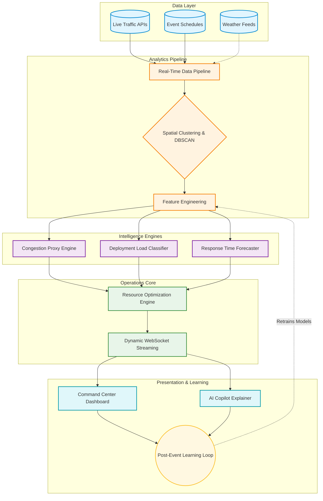

# GridWise AI Platform Architecture

GridWise AI is not simply a set of machine learning models. It is a comprehensive **Coordinate-First Operational Intelligence System** designed to bridge the gap between raw spatial data and real-time operational decision-making.

The following architecture diagram illustrates the end-to-end intelligence lifecycle, demonstrating how raw traffic and event coordinates are seamlessly transformed into dynamic optimizations and learning loops.

## System Lifecycle Diagram

## Component Overview

1. **Spatial Clustering (DBSCAN)**: Instead of relying on static zones, our system dynamically reconstructs operational clusters based on live incident density, enabling adaptive responses to unpredictable event spreads.
2. **Intelligence Engines**: We utilize XGBoost and Random Forest architectures to predict congestion severity, optimal deployment loads, and clearance times.
3. **Resource Optimization Engine**: Integrates predictive signals to allocate officers and barricades effectively across zones.
4. **WebSocket Streaming**: All intelligence is streamed with sub-second latency to the frontend command center.
5. **AI Copilot Explainer**: An LLM-driven layer translates raw optimizations into plain-English operational rationale (e.g., "Deploying 5 officers to Zone Alpha because historical spread probability is 85%").
6. **Post-Event Learning Loop**: Post-operation analytics automatically feed back into the feature store, ensuring continuous system refinement.
