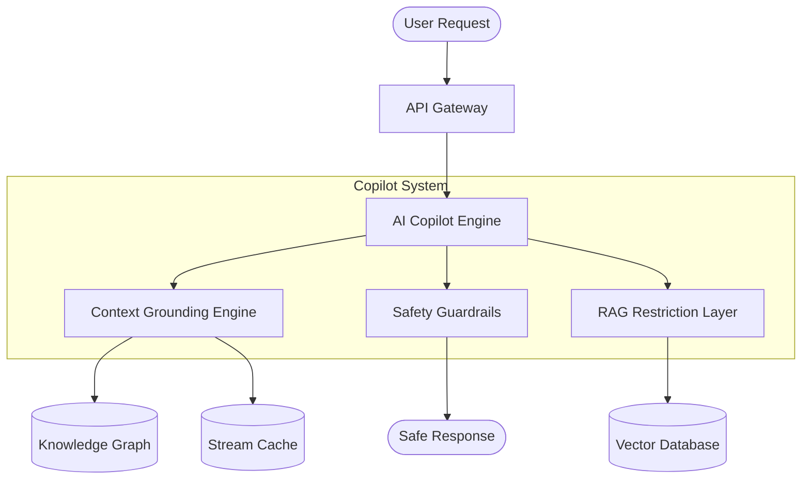
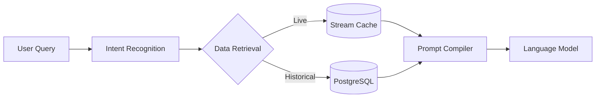
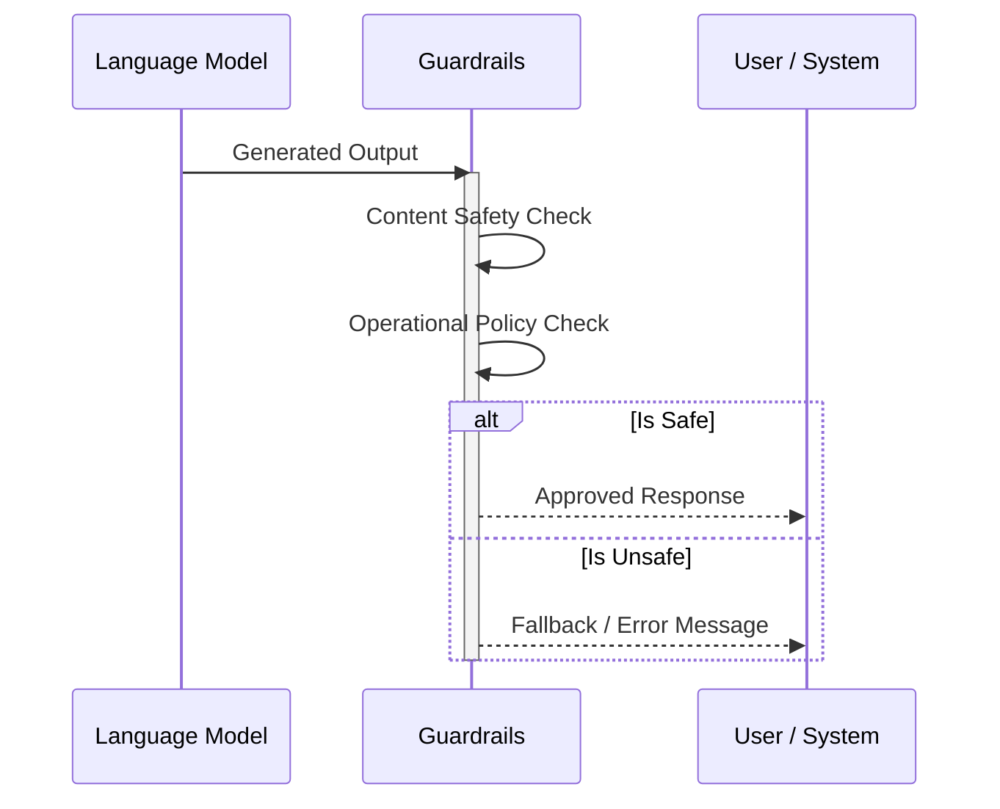

# AI Copilot Architecture

The AI Copilot is an advanced, multi-agent system designed to assist users in managing urban traffic, responding to events, and analyzing complex scenarios. It features robust safety mechanisms, context-aware reasoning, and controlled data access to ensure reliable and secure operations.

## High-Level Architecture

The architecture is composed of several key components working together:

## Context Grounding Engine

The Context Grounding Engine ensures that the AI Copilot's responses are accurate, relevant, and based on the most up-to-date real-time data and historical context.

- **Real-time Awareness:** Connects directly to the Stream Cache and Event Data sources to incorporate live traffic updates, incidents, and anomalies into the AI prompt.
- **Historical Analysis:** Utilizes historical data points to ground the AI in factual trends, avoiding hallucinations.
- **Dynamic Prompt Injection:** Seamlessly weaves contextual data into system prompts dynamically based on the specific query (e.g., explaining an ongoing incident vs. analyzing a past event).

## RAG Restriction Layer

The Retrieval-Augmented Generation (RAG) Restriction Layer controls how the AI accesses information from the vector database, enforcing access control and preventing prompt injection attacks.

- **Scope Limitation:** Restricts the vector search space based on user roles and current context.
- **Sanitization:** Cleans incoming queries to remove potentially malicious commands or prompt injection attempts before they reach the vector search engine.
- **Relevance Filtering:** Post-processes retrieved documents to ensure only highly relevant and authorized context is passed to the generation model.

## Guardrails

Guardrails act as a final layer of defense, ensuring that all outputs generated by the AI Copilot meet strict safety, ethical, and operational standards.

- **Output Validation:** Scans the generated response for harmful content, bias, or restricted information.
- **Action Verification:** Before suggesting or executing any operational plan (e.g., diverting traffic, deploying resources), the guardrails evaluate the plan against predefined safety thresholds.
- **Fallback Mechanisms:** If a response violates a rule, the guardrails trigger a fallback mechanism, either returning a pre-approved safe response or escalating the issue for human review.

