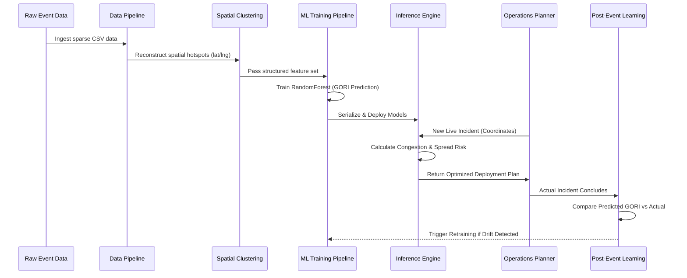

# GridWise AI Intelligence Lifecycle

GridWise AI transforms reactive traffic management into predictive operational intelligence. This document explains our end-to-end Machine Learning Architecture, explicitly demonstrating how raw data becomes an actionable deployment plan, and how the system learns from its mistakes.

## 1. The Core Architecture

We utilize a modular ML lifecycle consisting of three major pillars:
1. **Data Engineering** (`data_pipeline/`)
2. **ML Engineering** (`ml_pipeline/`)
3. **Real-time Inference** (`backend/app/stream/`)

### Architecture Flow

## 2. Key Differentiators

### Coordinate-First Spatial Intelligence
Traditional traffic systems rely on static "zones" or "junction names". Our exploratory analysis revealed this categorical data was severely sparse and error-prone.
* **Our Solution:** We discard static zones. Our `data_pipeline/spatial_clustering/` module uses **DBSCAN** algorithms on raw latitude/longitude coordinates to dynamically reconstruct traffic hotspots based on historical densities.

### Post-Event Learning
We directly solved the hackathon challenge requirement: *"No post-event learning system"*.
* **Our Solution:** The `ml_pipeline/post_event_learning/` module evaluates the actual congestion reduction achieved by the deployed officers against the ML's prediction. If the prediction error exceeds 15%, the system triggers an automatic retraining hook to adapt to changing urban conditions.
