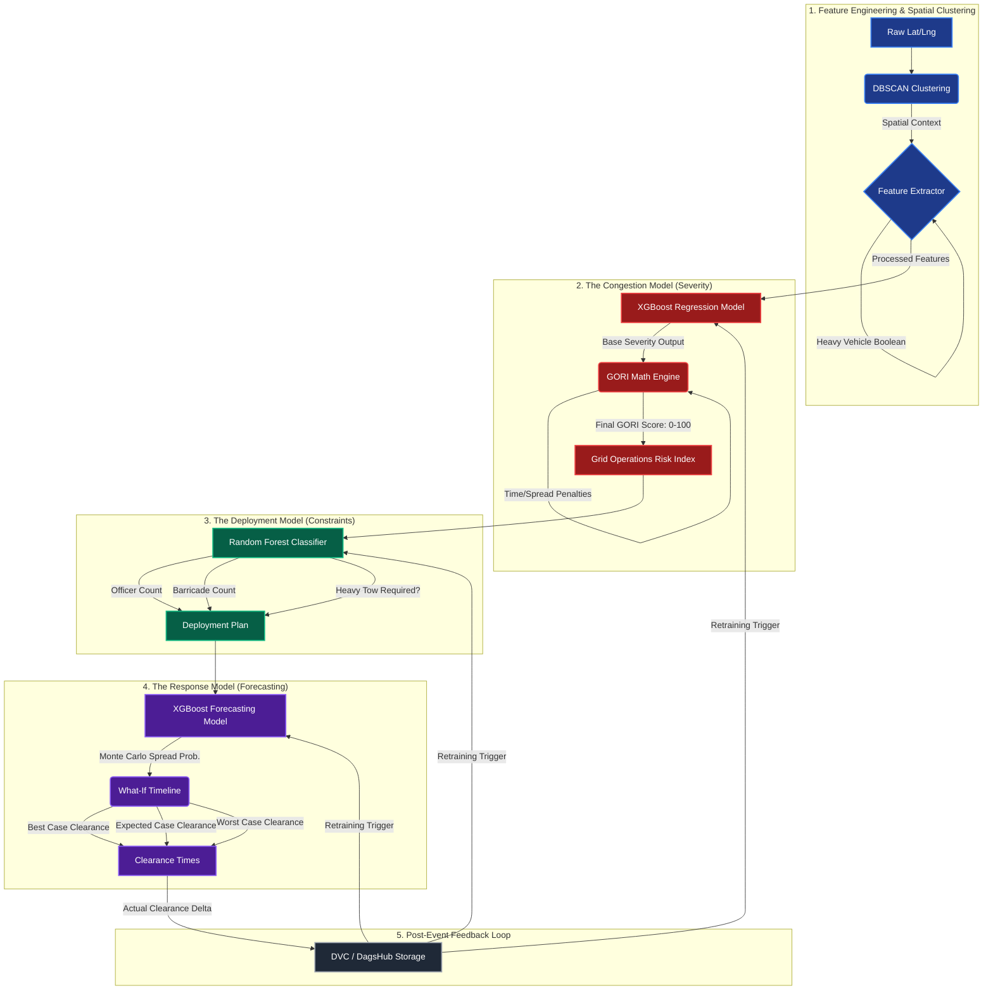

# Machine Learning Lifecycle

This document visualizes the exact, sequential flow of the GridWise AI Machine Learning pipeline, highlighting the dependencies between the specialized inference models.

## Operational Intelligence Sequence

## Explanation
*   **Sequential Dependency:** The models do not execute in parallel. The Random Forest Deployment model *strictly requires* the GORI output of the XGBoost Congestion model to calculate its dispatch.
*   **Coordinate-First:** Notice that the very first step is DBSCAN clustering. We do not use predefined road junctions. We cluster raw coordinates on the fly to find anomalous densities.
*   **The Feedback Loop:** This demonstrates our MLOps maturity. The final "Actual Clearance Delta" is passed back into DagsHub to trigger retraining, ensuring the system learns from its operational failures.
