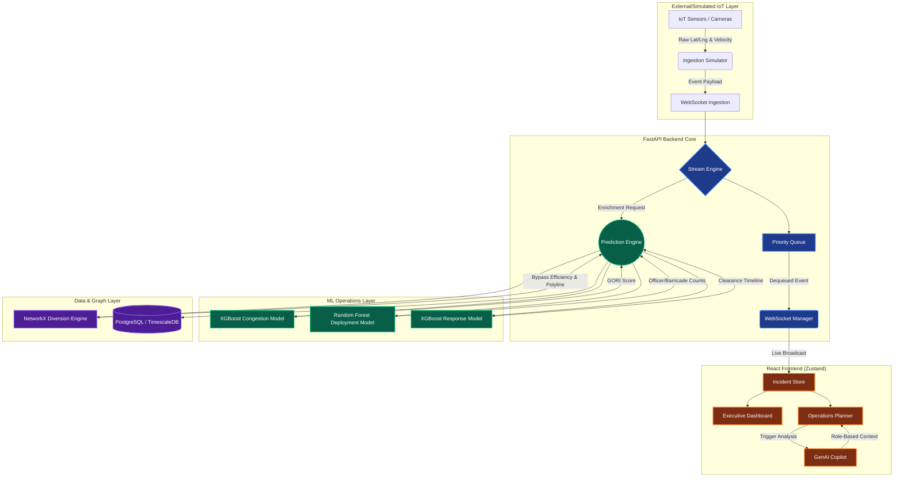

# System Architecture

This document visualizes the high-level system architecture of GridWise AI, illustrating the flow of data from ingestion to UI visualization.

## High-Level Data Flow

## Explanation
*   **External Layer:** Simulates real-world traffic camera feeds entering the system.
*   **Backend Core:** Built on FastAPI, it uses asynchronous queues to handle massive throughput without blocking UI updates.
*   **ML Operations:** The multi-model sequential pipeline that calculates the proprietary Grid Operations Risk Index (GORI) and translates it into physical deployment constraints.
*   **React Frontend:** Subscribes to the WebSocket Manager to instantly reflect incident severity and calculate macro-level city averages.
