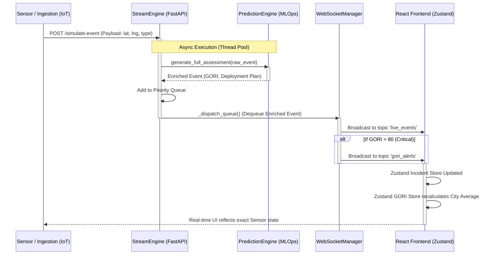

# WebSocket Event Flow

This document visualizes the exact, non-blocking asynchronous event lifecycle that powers the real-time UI synchronization in GridWise AI.

## Real-Time Synchronization Architecture

## Explanation
*   **Thread-Pooled Inference:** The FastAPI event loop is single-threaded async. Because ML inference (XGBoost/Random Forest) is CPU-bound and blocking, `StreamEngine` pushes the inference request to an `asyncio` ThreadPoolExecutor to prevent blocking other incoming WebSocket connections.
*   **Dual-Topic Broadcasting:** The WebSocket Manager broadcasts the core incident data to `live_events`, but also listens for critical thresholds (GORI > 80) to simultaneously fire alerts to the `gori_alerts` channel, which drives the "Executive Alert Notifications" component on the frontend.
*   **Zustand Recalculation:** The moment the React frontend receives the payload, it not only adds the incident to the map but triggers a mathematical recalculation of the entire city's Average GORI score, instantly updating the macro dashboard dial.
