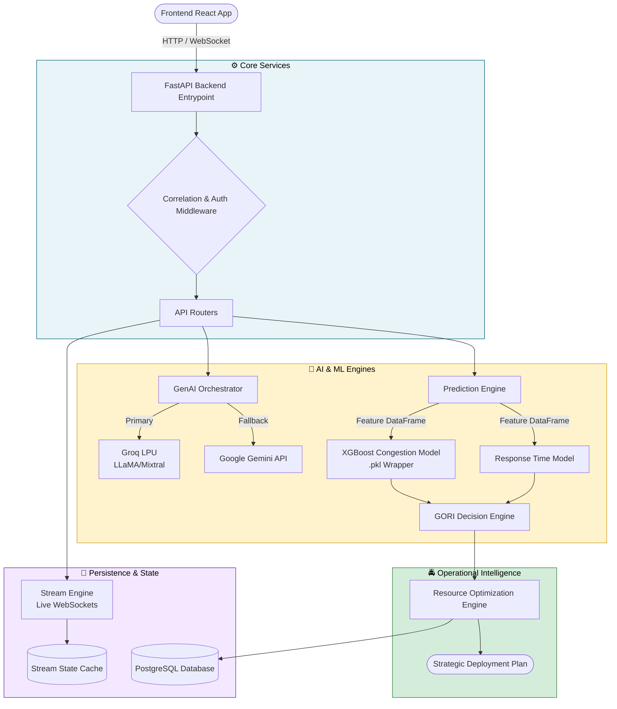

# Backend Architecture

## Overview
Gridwise AI is built with **FastAPI**. It follows a modular, domain-driven design, utilizing async execution, robust middleware, and structured observability.

## Directory Structure
- `backend/app/main.py`: Application entrypoint configuring FastAPI, middleware, routing, and exception handlers.
- `backend/app/api`: Defines the REST API endpoints and websockets via `router.py`. Versioning is supported (e.g., `v1/`).
- `backend/app/core`: Configuration, core constants, structured logger, and custom middleware (`CorrelationIdMiddleware`, `CORS`).
- `backend/app/services`: Domain services encompassing geo, events, simulation, and resource optimization.
- `backend/app/stream`: Handles Real-Time AI Traffic Operations Intelligence Stream via websockets, fast caching (`stream_cache`), and background simulators.
- `backend/app/resource_optimization`: AI Operations Command Center for generating dynamic resource allocation plans.
- `backend/app/observability`: Registry for metrics tracking, latency recording, and failure tracking.

## Request Flow
1. **Middleware**: All requests pass through `CorrelationIdMiddleware` adding `x-trace-id`, `x-request-id`, and `x-session-id`, tracking overall latency and metrics.
2. **Routers**: Mapped to corresponding functional areas (`events`, `optimization`, `stream`, etc.).
3. **Services / Business Logic**: Separation of routing layer and domain logic processing.
4. **Data Access**: Asynchronous SQLAlchemy usage for database persistence.
