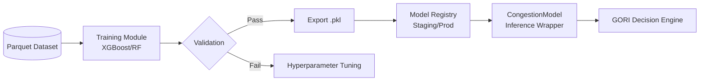

# Machine Learning Pipeline

## Overview
This document outlines the Machine Learning pipeline architecture for Gridwise AI.

## Current Implementation Status
A comprehensive review of the `backend/app/ai/` and `mlops/` directories reveals that **there is currently no explicitly defined model training code using algorithms like XGBoost, Random Forest, or scikit-learn in the repository**.

Instead, the codebase focuses entirely on the **inference and model management layers**:
- **Inference Wrapper**: `backend/app/ai/models/congestion_model.py` implements a `CongestionModel` class that wraps a pre-trained model. It dynamically interacts with any generic model object that exposes a `predict()` method.
- **Decision Engine**: `backend/app/ai/engines/gori_engine.py` implements the GridWise Operational Risk Index (GORI) Engine, which calculates severity and risk metrics using the outputs of the congestion model alongside operational rules.
- **Model Loading**: Models are expected to be exported as `.pkl` artifacts (e.g., `congestion_model.pkl`) and loaded into the inference wrappers.

## Model Registry
The pipeline utilizes a registry to manage models:
- **Registry Engine (`ModelRegistry`)**: Retrieves feature schemas and model versions dynamically from a `model_registry.json` file in the artifacts directory.
- **Environment Promotion (`RegistryManager`)**: Located in `mlops/model_registry/registry_manager.py`, this handles promoting models between environments (e.g., Staging -> Production) by updating the registry file with the latest version, stage, features, and metrics.

## Future Work
Future iterations of the pipeline will need to implement the actual training scripts and evaluation code for specific model architectures (such as XGBoost or Random Forest) to produce the required `.pkl` artifacts.
